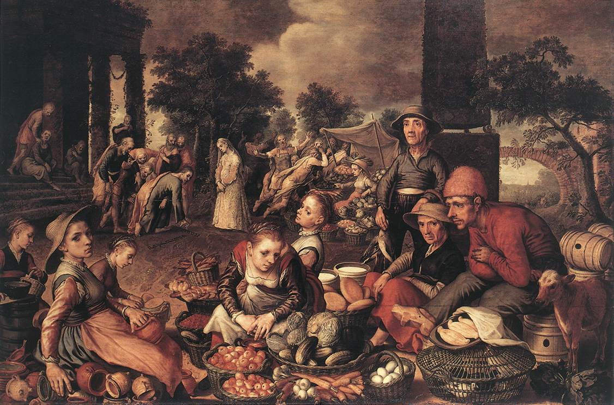

# Art Project

This repository contains the Art Critic Model which aims to be a sophisticated computational model capable of analyzing art pieces, particularly paintings, and generating critic-like descriptions of them. Additionally, the model provides the functionality to use the generated description and select a different artistic style, resulting in the generation of a new image that embodies the chosen style.




## Implementation Approaches

The project is implemented using two distinct approaches:

1. Fine-tuning Models: This approach leverages pre-trained models for classification and image-to-text tasks from the Hugging Face library. These models are fine-tuned on a carefully curated dataset of art pieces, enabling them to generate accurate and insightful descriptions. By fine-tuning these models, we ensure they capture the nuances and intricacies specific to the domain of art criticism.
2. Transfer Learning: In this approach, transfer learning techniques are employed with state-of-the-art models such as ResNet and ResNext. By utilizing transfer learning, we can leverage the knowledge and features learned from large-scale datasets to create new models specifically designed for image captioning and classification tasks in the context of art. These models are trained on an extensive collection of art pieces, enabling them to learn the distinctive patterns and characteristics inherent in various artistic styles.

## Table of Contents

- [Introduction](#introduction)
- [Requirements](#requirements)
- [Usage](#usage)
  - [Execute All Instances](#execute-all-instances)
  - [Execute a Single Instance](#execute-a-single-instance)
- [Folder Structure](#folder-structure)

## Introduction

This project uses transfer-learning and fine-tuning techniques to generate critic-like descriptions for art pieces, particularly paintings.

## Features

The main features of the Art Critic Model project include:

- Generation of critic-like descriptions for art pieces, particularly paintings.
- Ability to use the generated descriptions and select different artistic styles to generate new images.
- Fine-tuning of pre-trained models for accurate and meaningful description generation.
- Utilization of transfer learning techniques with models like ResNet and ResNext for image captioning and classification tasks.
- Training of specialized models on a comprehensive dataset of art pieces to capture domain-specific patterns and features.

## Requirements

Before running the solver, make sure you have the requirements installed on your system:

```console
pip install -r requirements.txt
```

You can also create a new conda environment by using the env.yml file

```console
conda env create -f env.yml
```

## Usage

Each folder contains a different part of the project.

The hugging face folder contains notebooks that are used to fine-tune Models from hugging face on our dataset.

The Transferlearning Folder contains notebooks where custom-made Transformer models are created starting from a baseline model.

There you can customize the parameters and train the models.

The Art Execution notebook takes all the checkpoints and feeds them an image, creating a Critic-like description.

## Folder Structure

The folder structure of the project is as follows:

```csharp
Art/
  ├── images/
  ├── Models_with_Trainer/
  ├── Transfer_learning_models/
  ├── Art_execution.ipynb
  ├── push_to_hub.ipynb
  ├── Scrap_description.ipynb
  ├── described_dataset_labels.csv
  ├── toy_dataset_labels.csv
  ├── env.yml
  ├── requirements.txt
  └── README.md
```

* images/: contains all images used to train and fine-tune the models
* Models_with_Trainer/: contains all the notebooks which fine tune the models from hugging face using the Trainer function from the transformer library and checkpoints
* Transfer_learning_models/: contains all the notebooks with the models which expands a baseline model with a new head for the art critic task

## Dataset Used

[ART500K](https://deepart.hkust.edu.hk/ART500K/art500k.html)

